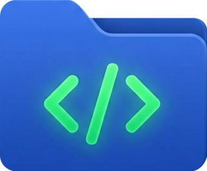

[🇷🇺 Русский](README.ru.md) · [🇬🇧 English](../README.md) · [🇫🇷 Français](README.fr.md) · [🇨🇳 中文](README.zh.md) · [🇪🇸 Español](README.es.md) · [🇮🇹 Italiano](README.it.md) · [🇸🇦 العربية](README.ar.md) · [🇧🇷 Português](README.pt.md) · [🇯🇵 日本語](README.ja.md) · [🇰🇷 한국어](README.ko.md) · [🇮🇳 हिन्दी](README.hi.md) · [🇹🇷 Türkçe](README.tr.md) · [🇳🇱 Nederlands](README.nl.md) · [🇵🇱 Polski](README.pl.md)

 

# CodeContext AI

**KI-gestütztes Codebase-Analyse- und Prompt-Vorbereitungstool**

<h2>🌟 Über das Projekt</h2>

<b>CodeContext AI</b> ist ein leistungsstarkes Desktop-Tool zur Vorbereitung Ihrer Codebasis für die Arbeit mit großen Sprachmodellen (LLMs). Es scannt Projektordner, analysiert die Struktur, erstellt Abhängigkeitsgraphen und generiert einen einzigen, perfekt strukturierten Prompt — optimiert für Token-Verbrauch und architektonische Klarheit.

<h3>❓ Warum?</h3>

Bei der Arbeit mit KI stoßen Entwickler an die Grenzen des Kontextfensters — LLMs « verlieren » die architektonische Kohärenz, wenn Code in Teilen kopiert wird. <b>CodeContext AI löst dieses Problem</b> : Sammeln Sie Ihr gesamtes Projekt in wenigen Klicks in einem strukturierten Prompt und sparen Sie bis zu 80 % der Tokens.

<h2>🚀 Funktionen</h2>

<table>
<thead><tr><th>Funktion</th><th>CodeContext AI</th><th>Manuell</th></tr></thead>
<tbody>
<tr><td>🗜️ Minify + Skeleton</td><td><b>Bis zu 80 %</b> Token-Reduktion</td><td>Manuelles Kopieren</td></tr>
<tr><td>🧩 LLM Patcher</td><td>Vorschau & Anwendung von JSON-Patches</td><td>Nicht verfügbar</td></tr>
<tr><td>✅ LLM Checker</td><td>Automatische Code-Überprüfung vor dem Speichern</td><td>Nicht verfügbar</td></tr>
<tr><td>🔗 AST-Abhängigkeitsgraph</td><td>Python, JS/TS, Vue</td><td>Nur Dateiliste</td></tr>
<tr><td>🖱️ Kontextmenü</td><td>Windows / Linux</td><td>Keine</td></tr>
<tr><td>🎨 Themes</td><td>Apple, Modern, benutzerdefiniertes JSON</td><td>Feste UI</td></tr>
<tr><td>⚙️ UI-Anpassung (v1.14+)</td><td>Premiere-Pro-Stil</td><td>Feste UI</td></tr>
<tr><td>🌐 i18n (v1.17+)</td><td>15 languages, system auto-detect</td><td>Single language</td></tr>
<tr><td>♻️ Dedup (v1.23+)</td><td>Detects & skips files with identical content</td><td>Manual check</td></tr>
<tr><td>⚡ Aggressive minify (v1.23+)</td><td>Extra compression — eliminates trailing whitespace on every line</td><td>Manual delete</td></tr>
<tr><td>📌 Checkpoints (v1.23+)</td><td>Save before/after snapshots for debugging</td><td>Not available</td></tr>
<tr><td>👁️ Auto-Watch (v1.23+)</td><td>Watches files & re-processes on change</td><td>Not available</td></tr>
</tbody>
</table>

<h2>📥 Installation</h2>

<b>Voraussetzungen :</b> Python 3.10+, Git

<pre>git clone https://github.com/NIKIRIKI7/CodeContext.git
cd CodeContext
python -m venv venv
# Windows :
venv\Scripts\activate
# Linux/macOS :
source venv/bin/activate
pip install -r requirements.txt</pre>

<h3>Windows .exe</h3>
<pre>pip install pyinstaller
pyinstaller --windowed --onefile --icon=assets/images/logo.ico --name "CodeContext AI" main.py</pre>

<h3>Arch Linux (AUR)</h3>
<table>
<thead><tr><th>Aktion</th><th>Befehl</th></tr></thead>
<tbody>
<tr><td>Installieren</td><td><code>yay -S codecontext-ai</code></td></tr>
<tr><td>Suchen</td><td><code>yay -Ss codecontext</code></td></tr>
<tr><td>Aktualisieren</td><td><code>yay -Syu</code></td></tr>
<tr><td>Entfernen</td><td><code>sudo pacman -Rns codecontext-ai</code></td></tr>
</tbody>
</table>

Falls <b>yay</b> nicht installiert ist :

<pre>sudo pacman -S --needed git base-devel
git clone https://aur.archlinux.org/yay.git
cd yay && makepkg -si</pre>

Alternative : <code>paru -S codecontext-ai</code>

<h2>💻 GUI-Modus</h2>
<pre>python main.py</pre>

<h3>1. Überblick über die Oberfläche</h3>

Das Fenster ist in drei Zonen unterteilt :

<ul>
<li><b>Linke Seitenleiste (Tabs)</b> — Scan-Einstellungen, Filter, Prompts, LLM-Konfiguration, Themes</li>
<li><b>Mittlerer Bereich</b> — Ordnerliste, Dateibaum, Token-Analyse</li>
<li><b>Obere Aktionsleiste</b> — Minify/No Comments/Skeleton-Umschalter, Ausgabeformat, Aktionsschaltflächen</li>
</ul>

<h3>2. Projekt hinzufügen</h3>
<table>
<thead><tr><th>Aktion</th><th>Wie</th></tr></thead>
<tbody>
<tr><td>Drag & Drop</td><td>Ziehen Sie einen Projektordner in das Fenster</td></tr>
<tr><td>Dialog öffnen</td><td>Klicken Sie « + Папка ПК » auf dem Tab <b>Sources</b></td></tr>
<tr><td>GitHub-Repo</td><td>Klicken Sie « + GitHub / PR » — fügen Sie eine Repo- oder Pull-Request-URL ein</td></tr>
<tr><td>Config speichern</td><td>Klicken Sie « 💾 Save config » — erstellt <code>.codecontextrc</code></td></tr>
</tbody>
</table>

<b>GitHub-Lademodi :</b>

<ul>
<li><b>Dauerhaft speichern</b> — klont in einen Ordner auf Ihrer Festplatte</li>
<li><b>Temporär</b> — klont in einen temporären Ordner (wird beim Schließen der App gelöscht)</li>
</ul>

<h3>3. Scan-Konfiguration</h3>

<h4>Sources-Tab</h4>
<table>
<thead><tr><th>Option</th><th>Beschreibung</th></tr></thead>
<tbody>
<tr><td>☑ Git Changes Only</td><td>Nur im letzten Commit geänderte Dateien einbeziehen</td></tr>
<tr><td>☑ Respect .gitignore</td><td>Dateien aus <code>.gitignore</code> automatisch ausschließen</td></tr>
<tr><td>🔍 Scan Files</td><td>Dateibaum mit Metadaten erstellen</td></tr>
</tbody>
</table>

<h4>Filters-Tab</h4>
<table>
<thead><tr><th>Option</th><th>Beschreibung</th></tr></thead>
<tbody>
<tr><td><b>Erweiterungsvoreinstellungen</b></td><td>Schnellwechsel zwischen Sprachsätzen (Python, Web, Golang, Rust, C#, usw.)</td></tr>
<tr><td><b>Erweiterungen</b></td><td>Benutzerdefinierte Whitelist für Dateierweiterungen</td></tr>
<tr><td><b>Ignorierte Pfade</b></td><td>Ordner/Dateien überspringen (node_modules, .git, build, dist, usw.)</td></tr>
<tr><td>☑ Include file tree</td><td>Fügt die Ordnerstruktur am Anfang des Prompts ein</td></tr>
<tr><td>☑ Include dependency map</td><td>AST-basierte Importanalyse für Python/JS/TS</td></tr>
<tr><td>☑ Include Mermaid graph</td><td>Architekturdiagramm im Mermaid-Format</td></tr>
</tbody>
</table>

💡 <b>Benutzerdefinierte Voreinstellungen speichern :</b> Filter konfigurieren, auf 💾 klicken, Namen eingeben.

<h4>Prompts-Tab</h4>
<table>
<thead><tr><th>Option</th><th>Beschreibung</th></tr></thead>
<tbody>
<tr><td><b>Prompt-Voreinstellungen</b></td><td>Schnellwechsel des System-Prompts (Code Review, Bug Hunter, Refactoring, usw.)</td></tr>
<tr><td><b>System-Prompt</b></td><td>Benutzerdefinierter Prompt — wird als Systemkontext an das LLM gesendet</td></tr>
<tr><td><b>🧩 JSON-Patch anwenden</b></td><td>LLM-JSON-Antwort einfügen — Diff-Vorschau anzeigen und auf Festplatte anwenden</td></tr>
</tbody>
</table>

<b>Verwendung von JSON-Patches :</b>

<ol>
<li>Fordern Sie ein JSON-Array vom LLM an : <code>[{"action": "replace", "file": "main.py", "search": "...", "content": "..."}]</code></li>
<li>JSON einfügen, auf <b>"Next"</b> klicken → der <b>Safety Diff Viewer</b> öffnet sich</li>
<li>Dateien auswählen/abwählen, optional auf <b>"🤖 Check via LLM"</b> klicken</li>
<li>Auf <b>"💾 Save selected to disk"</b> klicken</li>
</ol>

<h3>4. Ausgabeformateinstellungen</h3>
<table>
<thead><tr><th>Option</th><th>Beschreibung</th></tr></thead>
<tbody>
<tr><td>☑ Minify</td><td>Entfernt Leerzeichen und Leerzeilen</td></tr>
<tr><td>☑ Aggressive</td><td>Aggressive minification — strips all blank lines</td></tr>
<tr><td>☑ No Comments</td><td>Entfernt alle Kommentare</td></tr>
<tr><td>☑ No Secrets</td><td>Maskiert API-Schlüssel, Passwörter, Tokens</td></tr>
<tr><td>☑ Skeleton ☠️</td><td><b>Entfernt Funktionsrümpfe</b> — maximale Token-Ersparnis</td></tr>
<tr><td>☑ Dedup</td><td>Removes duplicate files with identical content</td></tr>
<tr><td>☑ Checkpoints</td><td>Saves intermediate processing checkpoints</td></tr>
<tr><td>☑ Auto-Watch</td><td>Auto-reprocess on file changes</td></tr>
<tr><td>Format</td><td>Markdown, XML, Plain, JSONL Chunks, Custom (Jinja2)</td></tr>
<tr><td>📁 template</td><td>Jinja2-Template-Auswahl</td></tr>
</tbody>
</table>

<b>Skeleton-Modus :</b> entfernt Funktionsimplementierungen (<code>def func_name(...):  # ... Implementierung ...</code>), behält alle Klassen — ermöglicht es dem LLM, große Projekte mit minimalen Tokens zu verstehen.

<b>Minify vs Aggressive:</b> <b>Minify</b> strips leading/trailing whitespace and removes blank lines — safe for any codebase, reduces tokens without affecting readability. <b>Aggressive</b> adds an extra pass that eliminates trailing whitespace on every line for maximum compression. Combine both when you need to fit more code into a limited context window.

<b>Dedup:</b> automatically detects files with identical content across your project and excludes duplicates from the output — prevents LLM from seeing the same code twice and wasting tokens.

<b>Checkpoints:</b> saves intermediate results at each pipeline stage (before cleanup, after minification, etc.) to <code>checkpoints/</code> folder. Useful for debugging what each processing step does or comparing outputs side by side.

<b>Auto-Watch:</b> monitors your project files for changes using the OS file watcher. When a file is saved, the pipeline automatically re-runs — ideal during active development when you need continuous prompt updates.

<h3>5. Aktionsschaltflächen</h3>
<table>
<thead><tr><th>Schaltfläche</th><th>Aktion</th></tr></thead>
<tbody>
<tr><td>👀 Preview</td><td><b>Advanced Preview Dialog</b> — Tabs « Final Prompt » + « Before/After »</td></tr>
<tr><td>📋 Copy to Clipboard</td><td>Ergebnis kopieren — in ChatGPT / Claude einfügen</td></tr>
<tr><td>🚀 Send to ChatGPT / Claude</td><td>Öffnet den Web-Chat und fügt den Kontext ein</td></tr>
<tr><td>💻 Open in Editor</td><td>Öffnet in VS Code / Cursor</td></tr>
<tr><td>💾 Save to File</td><td>Ergebnis auf Festplatte speichern</td></tr>
</tbody>
</table>

<h3>6. Advanced Preview Dialog</h3>

<b>Tab « 📝 Final Prompt » :</b> Dateiliste (links) + vollständiger Text mit Hervorhebung (rechts). Copy All / Copy File.

<b>Tab « 🔍 Before/After » :</b> farbiger Diff zwischen Original und Optimierung. Zähler : <code>Before: 1500 → After: 300 (80%)</code>.

<h3>7. LLM & Betriebssystem</h3>
<table>
<thead><tr><th colspan="2">LLM Checker</th></tr></thead>
<tbody>
<tr><td>☑ Enable verification</td><td>Automatische LLM-Überprüfung vor dem Anwenden von Patches</td></tr>
<tr><td>URL / Key / Model</td><td>API-Endpunkt (Standard OpenAI), Schlüssel, Modell</td></tr>
<tr><td>🦙 Ollama</td><td><code>http://localhost:11434/v1</code> / <code>llama3</code></td></tr>
<tr><td>🖥 LM Studio</td><td><code>http://localhost:1234/v1</code> / <code>local-model</code></td></tr>
</tbody>
</table>

<table>
<thead><tr><th colspan="2">Betriebssystem-Integration</th></tr></thead>
<tbody>
<tr><td>Kontextmenü installieren</td><td>« Open with CodeContext AI » im Rechtsklick-Menü</td></tr>
<tr><td>Zu PATH hinzufügen</td><td>Globaler <code>codecontext</code>-CLI-Befehl</td></tr>
<tr><td>Editor</td><td><code>code</code>, <code>cursor</code>, <code>idea</code>, <code>vim</code></td></tr>
</tbody>
</table>

<h3>8. Themes</h3>
<ul>
<li><b>Theme :</b> Apple, Modern — <b>Modus :</b> hell / dunkel</li>
<li>📂 Theme-Ordner öffnen / ➕ Theme importieren (.json)</li>
</ul>

<h3>9. 📊 Token-Analyse</h3>

Tabelle : Dateipfad, Tokens (tiktoken), Komprimierung, Ersparnis %, Kosten für das Modell.

<h3>10. 🎛️ UI-Anpassung (v1.14+)</h3>

Klicken Sie <b>⚙</b> neben der Version — Dialog « Interface Settings (Premiere Pro style) ». Schalten Sie Tabs (Sources, Filters, Prompts, LLM & OS, Themes) und Aktionsschaltflächen (Preview, Clipboard, ChatGPT, Editor, File) ein/aus.

<h3>11. Befehlspalette</h3>

<code>Ctrl+Shift+P</code> — mausfreier Zugriff auf alle Aktionen.

<h2>💻 CLI-Modus</h2>
<pre>python main.py --cli --path /pfad/zum/projekt [optionen]</pre>
<pre>python main.py --help</pre>

<table>
<thead><tr><th>Parameter</th><th>Typ</th><th>Beschreibung</th><th>Beispiel</th></tr></thead>
<tbody>
<tr><td><code>--cli</code></td><td>flag</td><td>CLI-Modus (ohne GUI)</td><td><code>--cli</code></td></tr>
<tr><td><code>--path</code></td><td>Liste</td><td>Projektpfad</td><td><code>--path ./app</code></td></tr>
<tr><td><code>--ext</code></td><td>str</td><td>Dateierweiterungen</td><td><code>--ext ".py .js"</code></td></tr>
<tr><td><code>--ignore</code></td><td>str</td><td>Ignorierte Pfade</td><td><code>--ignore "node_modules"</code></td></tr>
<tr><td><code>--mode</code></td><td>enum</td><td>none / default / shallow / deep</td><td><code>--mode deep</code></td></tr>
<tr><td><code>--format</code></td><td>enum</td><td>markdown / xml / plain / jsonl_chunk</td><td><code>--format xml</code></td></tr>
<tr><td><code>--minify</code></td><td>flag</td><td>Minifizierung aktivieren</td><td><code>--minify</code></td></tr>
<tr><td><code>--no-comments</code></td><td>flag</td><td>Kommentare entfernen</td><td><code>--no-comments</code></td></tr>
<tr><td><code>--no-secrets</code></td><td>flag</td><td>Geheimnisse maskieren</td><td><code>--no-secrets</code></td></tr>
<tr><td><code>--skeleton</code></td><td>flag</td><td>Skeleton-Modus</td><td><code>--skeleton</code></td></tr>
<tr><td><code>--output</code></td><td>str</td><td>Ausgabedatei</td><td><code>--output out.txt</code></td></tr>
<tr><td><code>--stdout</code></td><td>flag</td><td>Auf stdout ausgeben</td><td><code>--stdout</code></td></tr>
<tr><td><code>--git</code></td><td>flag</td><td>Nur Git-Änderungen</td><td><code>--git</code></td></tr>
<tr><td><code>--gitignore</code></td><td>flag</td><td>.gitignore beachten</td><td><code>--gitignore</code></td></tr>
<tr><td><code>--tree</code></td><td>flag</td><td>Dateibaum</td><td><code>--tree</code></td></tr>
<tr><td><code>--mermaid</code></td><td>flag</td><td>Mermaid-Graph</td><td><code>--mermaid</code></td></tr>
<tr><td><code>--dependencies</code></td><td>flag</td><td>Abhängigkeitskarte</td><td><code>--dependencies</code></td></tr>
<tr><td><code>--patch</code></td><td>str</td><td>LLM-JSON-Patch</td><td><code>--patch patch.json</code></td></tr>
<tr><td><code>--template</code></td><td>str</td><td>Jinja2-Template</td><td><code>--template my.j2</code></td></tr>
<tr><td><code>--system-prompt</code></td><td>str</td><td>Benutzerdefinierter System-Prompt</td><td><code>--system-prompt "Review"</code></td></tr>
</tbody>
</table>

<h3>Beispiele</h3>
<pre># Minimale Ausführung
python main.py --cli --path ./myapp --stdout

# Vollständige Analyse mit XML
python main.py --cli --path ./myapp --ext ".py .js .ts" --ignore "node_modules,.git,__pycache__" --mode deep --mermaid --tree --dependencies --minify --no-comments --skeleton --format xml --output analysis.xml

# Git-Diff
python main.py --cli --path ./myapp --git --gitignore --stdout

# LLM-JSON-Patch
python main.py --cli --path ./myapp --patch llm_response.json

# Benutzerdefiniertes Jinja2-Template
python main.py --cli --path ./myapp --template my.j2 --stdout

# Mermaid-Diagramm
python main.py --cli --path ./myapp --mode deep --mermaid --output with_mermaid.md

# Mehrere Pfade
python main.py --cli --path ./frontend ./backend --format xml --output combined.xml</pre>

<h2>🏗️ Technologie-Stack</h2>
<table>
<thead><tr><th>Komponente</th><th>Technologie</th></tr></thead>
<tbody>
<tr><td>Sprache</td><td>Python 3.10+</td></tr>
<tr><td>GUI-Framework</td><td>PySide6 (Qt 6)</td></tr>
<tr><td>Architektur</td><td>Clean Architecture + Redux-like</td></tr>
<tr><td>Tokenisierung</td><td>tiktoken (OpenAI)</td></tr>
<tr><td>Templating</td><td>jinja2 (11 integrierte Vorlagen)</td></tr>
<tr><td>AST-Parser</td><td>ast (Python), tree-sitter (JS/TS/Go/Rust)</td></tr>
<tr><td>Distribution</td><td>PyInstaller, AUR</td></tr>
</tbody>
</table>

<h2>🗺️ Roadmap</h2>
<ul>
<li>🍎 macOS Finder-Kontextmenü</li>
<li>🤖 Direkte OpenAI/Anthropic-API-Integration</li>
<li>🏛️ Hexagonalarchitektur-Analyse</li>
<li>🔌 Plugin-System</li>
<li>🌐 In-App-i18n</li>
</ul>

<h2>👨‍💻 Team</h2>

<b>Entwickler :</b> mcniki · <a href="https://vk.com/gor_niki">VK: gor_niki</a> · Issues & PRs auf GitHub

<h2>🤝 Mitwirken</h2>
<ol>
<li>Repository forken</li>
<li>Branch : <code>git checkout -b feature/AmazingFeature</code></li>
<li>Commit : <code>git commit -m 'Add AmazingFeature'</code></li>
<li>Push : <code>git push origin feature/AmazingFeature</code></li>
<li>Pull Request</li>
</ol>

Befolgen Sie die SOLID-Prinzipien (siehe <code>docs/ARCHITECTURE.md</code>).

<h2>📄 Lizenz</h2>

MIT. Einzelheiten in <code>LICENSE</code>.

